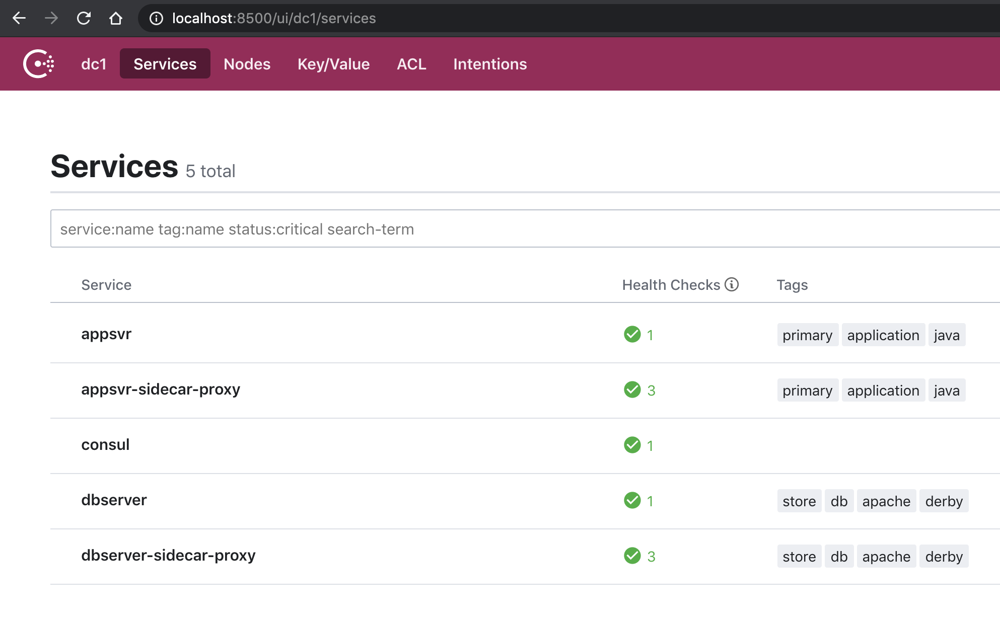
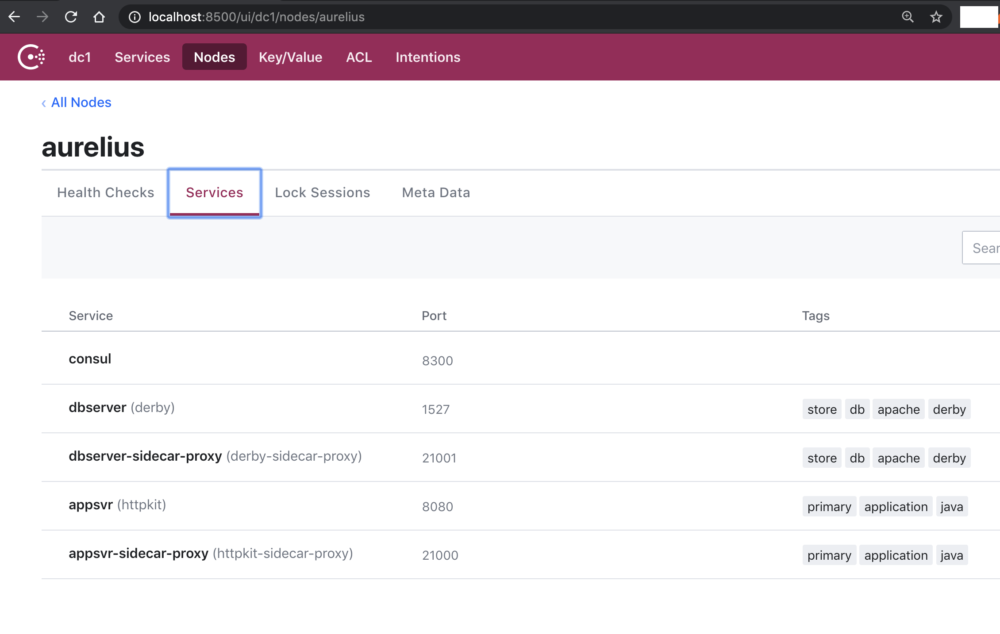

## Hashicorp SC Exercise


### Consul – connect services with mutual TLS

A prospect is interested in establishing mutual TLS between applications or services

* Demonstrate consul connect establishing connectivity and service segmentation between a Tomcat app or another app and a database.
* Demonstrate denying access from the app to the database using intentions toggle approval or denial of connectivity (live demo)
* Describe the solution, slides, Consul UI, etc
* Be ready to answer technical questions about the solution, compared to GTM, etc

### Getting Started

#### Prerequisites
---

* Install [Clojure](www.clojure.org)
* Install [Leiningen](www.leiningen.org).
* [Apache Derby](http://db.apache.org/derby/) is the database used but is included in this exercise.
* Install [Hashicorp's Consul](https://www.consul.io/) to handle your service discovery, segmentation and configuration.


#### Running The Code
---

1. Start Derby. From a terminal, change into the hashi directory and run the startdb.sh script

````bash  
$ cd hashi
$ ./startup.sh
````

2. Start the web application server

````bash  
$ lein clean; lein run
````

3. Start the consul agent
````bash  
./startcon.sh
````

This basically executes
````
## kick off without -enablechecks
consul agent -dev -enable-script-checks -config-dir=../consul -node aurelius

````

which is
 * dev mode enabled
 * script checking prevents arbitrary malicious execution of code by the agent
 * supply a configuration directory
 * name this consul agent node because my machine does not have a friendly name - i want it easy!

4. Start the proxies

 ````bash  
./startproxies.sh
 ````

 This will background the proxies for both the app server and database server.

5. Check out the web UI and you should see something like the following



and health checks should show healthy sidecar proxies and services

 

 You should also see your ports setup as follows

 
