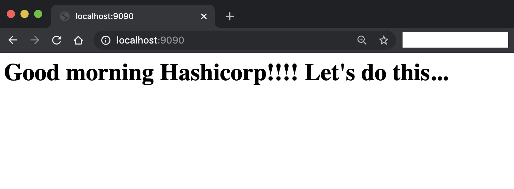

## Hashicorp Consul Example

A prospect is interested in establishing mutual TLS between applications or services

* Demonstrate consul connect establishing connectivity and service segmentation between a Tomcat app or another app and a database.
* Demonstrate denying access from the app to the database using intentions toggle approval or denial of connectivity (live demo)
* Describe the solution, slides, Consul UI, etc
* Be ready to answer technical questions about the solution, compared to GTM, etc


### Proposed solution

Hashicorp's Consul is a fantastic way to connect existing/legacy applications and services using TLS connections WITHOUT retrofitting them to perform SSL. It is quick and easy to configure and can deliver the following benefits

 * Out of the box health checking. The consul agent automatically checks if services are up and running and allows you to react if services are down and since it is done locally, it is all distributed

 * Updates are only sent to healthy hosts meaning that faulty nodes will not be needlessly sent traffic they cannot handle.

 * Secure communications between services without incurring the cost of new development to add TLS encryption between applications for very little extra footprint

 * Can eliminate the cost of additional load balancers since it has healthchecks and a DNS resolution service

 * Can be used across datacenters, securing links cross them while having configuration specific to each datacenter captured in its KV store.

 * Visibility through the consul web application improves the user experience in seeing and managing services, including adding/removing intentions.  

 ..and lot more


### How it was done
---


###### image credit: Unsplash Photo by Daniel Gonzalez

If you would like to go directly to the solution description then go [here](./docs/plan.md)


#### How to run it
---

* Install [Clojure](www.clojure.org)
* Install [Leiningen](www.leiningen.org).
* [Apache Derby](http://db.apache.org/derby/) is the database used but is included in this exercise.
* Install [Hashicorp's Consul](https://www.consul.io/) to handle your service discovery, segmentation and configuration.


#### Running The Code
---

1. Start Derby. From a terminal, change into the hashi directory and run the startdb.sh script

````bash  
$ cd hashi
$ ./startdb.sh
````

2. Start the web application server

````bash  
$ lein clean; lein run
````

3. Start the consul agent
````bash  
./startcon.sh
````

This basically executes
````
## kick off agent with a node name
consul agent -dev -enable-script-checks -config-dir=../consul -node aurelius

````

which is
 * dev mode enabled
 * script checking prevents arbitrary malicious execution of code by the agent
 * supply a configuration directory
 * name this consul agent node because my machine does not have a friendly name - i want it easy!

4. Start the proxies

 ````bash  
./startproxies.sh
 ````

 This will background the proxies for both the app server and database server.

5. Check out the web UI and you should see something like the following


and health checks should show healthy sidecar proxies and services

 

 You should also see your ports setup as follows

 


 6. To access the site unencrypted you can hit

    http://localhost:8080/ or http://localhost:8080/list-posts

    however, you can now access the service mesh by connecting to the proxies

    http://localhost:9090/ or http://localhost:9090/list-posts which uses consul

    See below

    

    and with database access

    


 7. Add an intention to allow or deny access to the db server as shown below

  

  When set to deny then you cannot access the database listing

  
