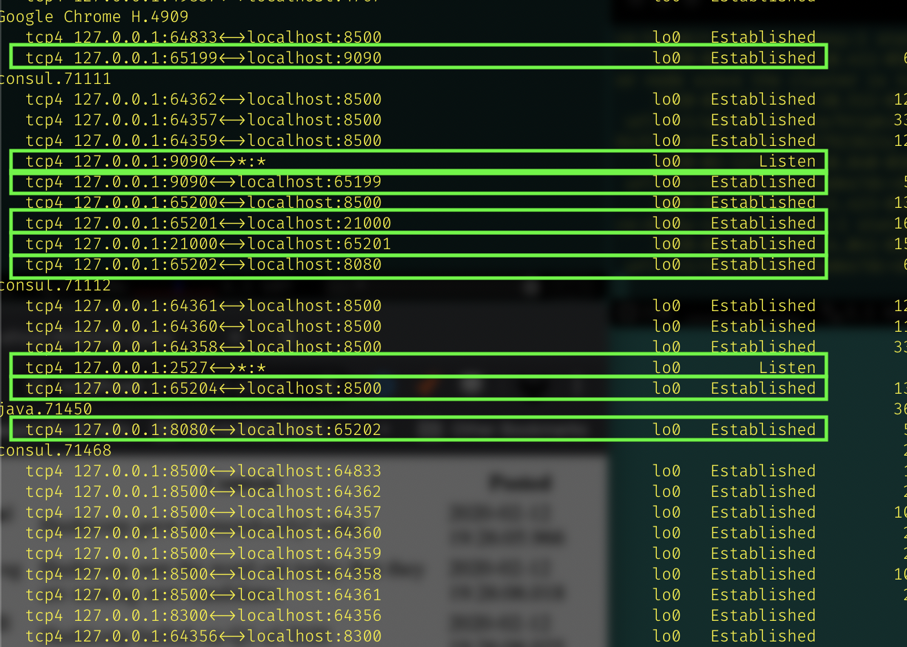

# Exercise : Hashicorp

by *James Nyika*


### Consul – connect services with mutual TLS

A prospect is interested in establishing mutual TLS between applications or services

* Demonstrate consul connect establishing connectivity and service segmentation between a Tomcat app or another app and a database.
* Demonstrate denying access from the app to the database using intentions toggle approval or denial of connectivity (live demo)
* Describe the solution, slides, Consul UI, etc
* Be ready to answer technical questions about the solution, compared to GTM, etc

### Plan of Action

 - [X] Read and understand instructions
 - [X] Prepare the requisite applications in place to support the exercise.
   - [X] Web Server: HTTPKIT
   - [X] Apache Derby Database (Network Mode)
   - [X] Simple API - Create, List, Drop, Sort by Col, Find by ID
   - [X] Verify ability run from localhost and remotely

- [X] Install and Configure Consul services
  - [X] Verify the services are seen and monitored as being up and running
  - [X] Configure multiple services in a single config file
  - [X] Configure running proxy for App server
  - [X] Configure running proxy for DB Server
  - [X] Configure and test a proxy service that can test the encryption from proxy to service
  - [X] Verify the traffic is encrypted (? using wireshark ? )
  - [X] Configure the upstream connectivity between the two services
  - [ ] Configure the TLS connectivity between them
  - [ ] Validate encryption between the links
  - [ ] Add monitoring checks 20s apart for both server and client

- [ ] Configure deny intents
  - [ ] Verify working intentions

- [ ] Prepare Slides
    [ ] Demonstrate value of the solution
    [ ] Draw up list of possible objections to the solution
    [ ] Draw up list of possible questions
    [ ] Capture/Learn the Raft Algorithm

 - [ ] Practice
 - [ ] Screen Captures

### Visualizing the result

 The plan was to implement This

 


### Challenges Encountered

 #### Technical Challenges
 ---

 * General Network Connectivity for Derby [#2](https://github.com/jamesnyika/hashi/issues/2)
   Action Taken: Derby documentation link was broken explaining how to do this. Forums provided the answer to change the configuration
 * Configuring database driver loading [#1](https://github.com/jamesnyika/hashi/issues/1)
   Action Taken: Located Maven import format for driver and used that directly in my code
 * Encountered Consul naming bug [Consul Issue 6765](https://github.com/hashicorp/consul/issues/6765)
   Action Taken: Used the suggested workaround to just use lower case names till it is fixed
 * General lack of clarity in the documentation about when to use service name vs service id.
   Action Taken: Document my finding and hopefully not make the mistake again. I have both in my config files.

 * Generally challenging to understand which ports belong to which proxies. I have to work out a system for understanding this. I overcame this challenge by using ```` nettop -c  -t loopback```` to look at port connections and where traffic was flowing.

 
