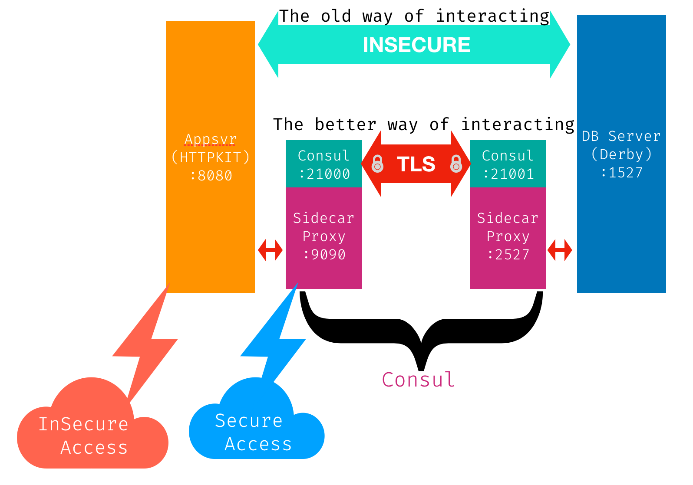

## Hashicorp SC Exercise - My Solution

The following is my solution to the exercise.

### Service and Proxy Definition
---

I used a single file to configure my proxies and services. In addition, I also configured a proxy with listener for the database that was standalone

````JSON
{"services":
  [
    {"id": "httpkit",
      "name": "appsvr",
      "port": 8080,
      "tags": ["primary","application","java"],
      "connect": { "sidecar_service": {
          "proxy": {
          "upstreams": [{
             "destination_name": "appsvr",
             "local_bind_port": 9090
          },
          {
             "destination_name": "dbserver",
             "local_bind_port":3527
          }
        ]
        }
        } }
   },
   {"id": "derby",
     "name": "dbserver",
     "port": 1527,
     "tags": ["store","db","apache","derby"],
       "connect": { "sidecar_service": {
           "proxy": {
             "upstreams": [{
                "destination_name": "dbserver",
                "local_bind_port": 2527
             }]
             }} }
  }
 ]
}

````

This resulted in the following architecture


